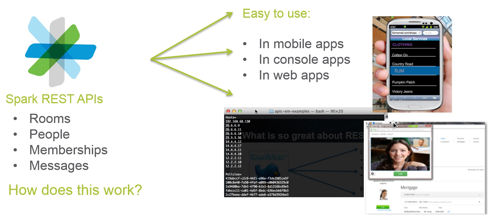
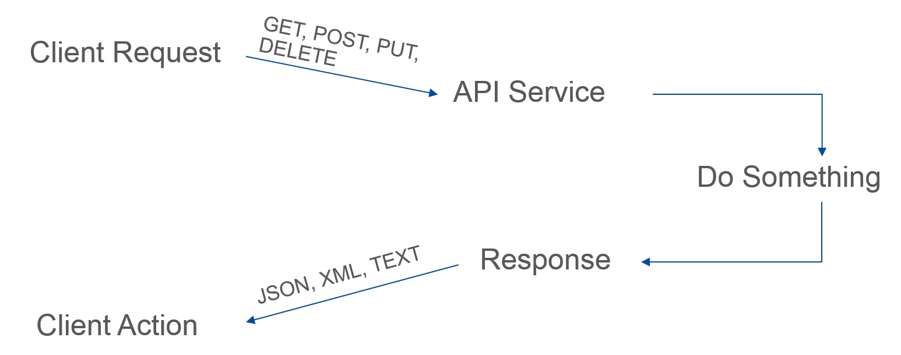
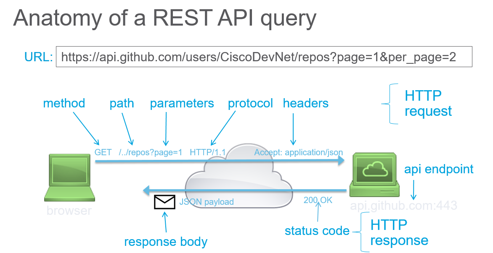
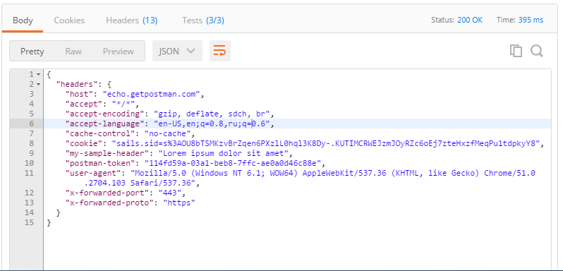
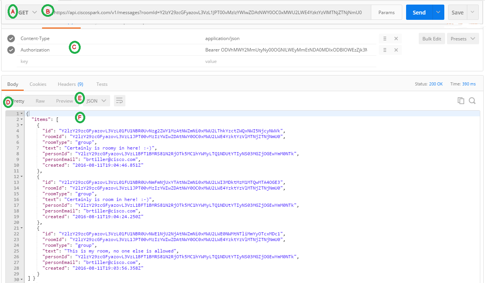
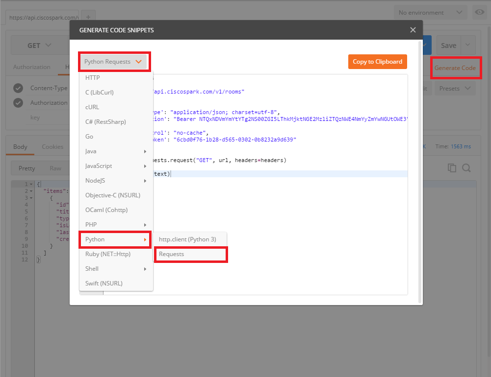
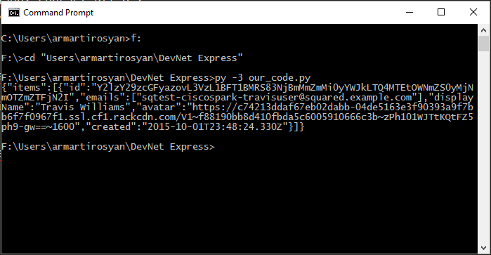
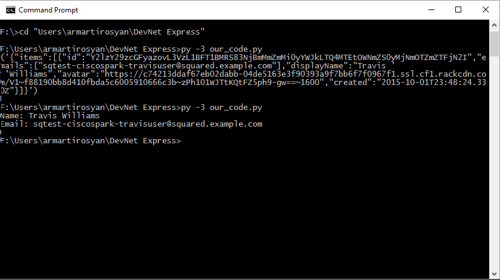

# REST

## Overview of APIs

We are going to begin our discussion on network programmability by discussing what an API is and why they are important. Let's start by making sure we have a good foundation by diving into some definitions.

An API (Application Programming Interface) is a way for two pieces of software to talk to each other. Think about the ways you typically interface with software. For example, you might open up a web interface to access your email. You might have a specific workflow to open up messages and file them away for later. Each of these workflows has a specific "interface" or way in which you achieve a certain task.

An API is similar in concept. Instead of humans interfacing with software, software interfaces with software. Rather than having a human point and click-through a workflow, an API exposes functionality to another application.

Why would you want to do this? One reason is that this allows for the development of rich applications with a wide variety of functionality. Let's go through an example.

Suppose you are the creator of a Restaurant Recommendation app and you want to easily integrate the ability to return a list of relevant restaurants in the area with a map application that displays where the restaurants are relative to your location. Would you create this functionality from scratch? Probably not.

Doing so would likely take you away from your core expertise. Also, think about all of the risk and learning curve required to build something like that from the ground up. Instead, it would be better to leverage a third party that already offers that functionality, and integrate the functionality into your applications.

A good example is a Maps Server. Rather than build map functionality from scratch, you could use an API provided the Maps Server to integrate map functionality quickly into your application.


Much like a wall outlet, an API enforces a specification of an interface. An API ensures that software adheres to the proper specifications much like an outlet ensures that devices adhere to the proper electrical specifications regardless of the vendor or device.

## Get Access To The Spark REST APIs

We are going to use the Spark REST API to start our programmability journey. Spark is a collaboration tool that allows people to chat and share files, plus other capabilities.

You need to set up a Spark developer account in order to explore the Spark REST API!

1.  Go to the Spark Developer website.
2.  Click on Sign Up button to create an account.
3.  Log in with your new credentials and click on the member icon located on the top right corner of the page and click on the 'Copy' button to copy your Access Token.


The token allows you to make Spark API calls.

Great! Now that we have the basics of APIs down, let's dive into REST APIs to see how they work.

## What is a REST web service?

In general, a web service is a way for two systems to communicate through a defined interface. In the past 20 years, there have been two major types of Web Services – REST or SOAP. In the last 10 years, the REST approach has become increasingly popular.

What is REST? REST (Representational State Transfer) is an architecture style for designing networked applications. A REST web service is a web service that is as easy to call as making an HTTP request.

Look at the diagram below. It shows how a browser retrieves web pages. Normally, after a user requests a particular resource in a browser, the appropriate web server responds with the proper HTML to display the page to your client browser.


Behind the scenes, HTTP(S) uses CRUD (Create, Read, Update, Delete) operations on the wire to request data. In the example below, our browser is issuing a GET operation to read the associated web page. The web server returns the associated data and an HTTP response to the client browser.


RESTful interfaces offer these same CRUD (Create, Read, Update, Delete) operations using HTTP(S). Browsers are replaced by software to interface with the RESTful service. The diagram below illustrates the same concept; however, browsers are replaced by software leveraging the REST API.


[Cool REST tutorial](http://rest.elkstein.org/)

## What is so great about REST?

REST is easy to use on any platform!

Let's talk about what makes REST APIs so great. First off, the concepts are transferable across a number of platforms. This lab shall focus on the Spark REST API as a tool to learn REST APIs. Spark is a communication platform for collaboration.



However, REST is also used by a number of networking platforms such as Cisco's APIC-EM controller. While the API and data model of APIC-EM differs, the underlying tools are the same.


## How does this work?

Now let's cover how REST APIs work. REST is centered around the HTTP request and response model. Consuming an API is just as simple as making an HTTP request.



For example, if we make a request to an API Service, then result of the request will be returned to us in the response. The data returned in the response is usually JSON or XML.

(JSON -- JavaScript Object Notation, is a lightweight text-based open standard designed for human-readable data interchange.)

## Examine the Anatomy of a REST API Query

To construct a request, you need to know the following information for the API that you are calling. You can find this information in the API reference documentation.

* Method
  * GET - Retrieve data
  * POST - Create something new
  * PUT - Update data
  * DELETE - Delete data
* URL
  * The URL for the endpoint you want to call
  * Example: http://api.ciscospark.com/v1/rooms
* URL Parameters
  * The parameters that you can pass as part of the URL.
* Authentication
  * You need to know the authentication type to use. Basic HTTP, token based, and OAuth are common types.
  * Authentication credentials
* Custom Headers
  * Does the API require you to send any HTTP Headers?
  * Example: Content-Type: application/json
* Request Body
  * JSON or XML containing data that is needed to complete request can be sent in the body of the request



## A Little About Authentication

There are different types of authentication for REST APIs. Authentication is used to control access and access rights to the REST APIs. For example, some users might have read-only access which means that they can use only the parts of the API that read data. Other users might have both read and write access. This means they can use the API to perform operations that not only read data but also add, edit, and delete data. These access rights are typically based on user assigned roles such as Administrator where a user would have full rights to change the data. For example, a plain User role might have read-only access rights.

## Types of Authentication Controls

* None: the Web API resource is public, anybody can place call. Generally the case for GET methods, rarely for POST, PUT, DELETE.
* Basic HTTP: The username and password are passed to the server in an encoded string.
  * Authorization: Basic ENCODEDSTRING
  * See Basic Authentication for more information.
* Token: A secret key generally retrieved from the Web API developer portal.
  * The keyword may change from one Web API to another: Bearer, token..
  * Passed with each API call.
  * See Token Based Authentication for more information.
* OAuth: A sequence flow is initiated to retrieve an access token from an Identity Provider. The token is then passed with each API call.
  * Open standard. User rights are associated with the token (OAuth scope).
  * The token expires. It can be revoked. It can also be re-issued via a refresh token.
  * See OAuth for more information.

## API Reference Documentation

The API Reference Documentation lists all of the publicly available API methods and provides the details on how to make each request. When you start to work with a new API, the API Reference is one of the most important sources of information. [Here's the API Reference Guide for Spark](https://developer.ciscospark.com/resource-people.html).

## What is in the Response?

The API Reference Guide includes information about the attributes to be sent and returned. The returned data is defined in the Response portion which includes the HTTP status codes along with the data format and attributes.

* HTTP Status Codes
* HTTP status codes are used to return success, error, or other statuses. http://www.w3.org/Protocols/HTTP/HTRESP.html
* Some common examples are:
  * 200 OK
  * 202 Accepted/Processing
  * 401 Not Authorized
* Content
  * Often returned in different formats based upon the request. Common formats are: JSON, XML and Text.
    * JSON (most commonly used)

```json
{
  "data": [
    {
      "company": "Cisco Systems",
      "event": "DevNet Express",
      "location": "Las Vegas, NV, USA"
    },
    {
      "company": "Cisco Systems",
      "event": "Cisco Live America",
      "location": "San Jose, CA, USA"
    }
  ]
}
```

Here is an example that shows a REST API request and response all in the same window:


## Use Postman to Call the Spark API

As briefly mentioned earlier Postman is an HTTP web user interface (Web UI) client that allows you to make HTTP calls. There are many Web UI clients that have similar functionality, but for our purposes we'll focus on Postman.

## What is Postman?

Postman is a Google Chrome application. It provides an easy-to-use interface for learning and interacting with REST APIs.

Users can send API calls and receive responses in the same window. This application can also be used to generate codes for different languages such as python. Postman is useful for entry-level users. To download and run Postman follow this link. We'll use Postman throughout this and following modules. Take a minute to make sure it is installed on your workstation.

## The Postman Window

Postman has three main working areas. On the left side of the window you can see History and Collections tabs. The History tab shows a list of your previous calls. If you want to save a particular API call from your History tab, you can click on the call to highlight it and then click the Save to collection link to specify where you want to save it.


In the middle of the screen is where all the magic happens. This is where you make the API calls by setting the call method and providing URL information. Under the Headers tab you should define all of the necessary key-value pairs to make a successful call. When all of the parameters are set, click the Send button.


If the request is correctly formed, after you click Send you should see a response on the bottom section of the window. The Response pane gives you information such as the Status code of the response, how it is formatted (JSON, XML, etc.), as well as the body of the response message.



## Postman Test Run: Call the Spark API

Let's make a call to the Spark API. Look at the screenshot below, it depicts an API call to Spark server. The letters show each step and explain the areas of the Postman window.

A. Shows the REST method to use to send the request. You can select the method from a drop down list. As previously discussed the most common methods are: `GET`, `POST`, `PUT` and `DELETE`. In this case we want to read in a list of messages posted by a particular user to a particular room. That means for this example we want to use the `GET` method.

B. The `URL` to be called is specified here. The base `URL` for SPARK is `https://api.ciscospark.com/v1/` . What follows next is the function to be called which is messages. Next is the `roomId` follow by the `ID` itself in the format of `?roomid=<the room ID>`

C. Spark requires an Access Token in order to make function calls. For that reason, we have added the key named Authorization to the header. We entered the value `Bearer <the access token>`. The `Content-Type` key specifies what type of formatted content is being sent to the HTTP Server which is designated in the URL by `api.ciscospark.com`. In this case no content is being sent so this header, though commonly used, is unnecessary. At this point the request is ready to be sent and the user would press the Send button.

D and E. The Body contains the data returned from the request. Because the returned format has been selected to be JSON, there's various types of ways to format this output. Raw output displays the data in the format received. Pretty output which is selected here, reformats the data to make it much easier to read.

F. The returned JSON content in Pretty format.



### Ejercicio de Postman #1

La idea de este ejercicio es conseguir una lista de todos los `rooms` a los cuales estamos asociados.

#### Instrucciones

1.  Crear una cuenta con Cisco Webex.
2.  Acceder a https://developer.webex.com/getting-started.html y conseguir su token de desarrollador.
    
3.  Ir a Postman.
4.  Seleccionar `GET` del dropdown.
5.  Escribir la siguiente URL: `https://api.ciscospark.com/v1/rooms`
6.  Agregar un encabezado `Authorization` con el token de desarrollador precedido por `Bearer`.
7.  Agregar un encabezado `Content-Type` con el valor `application/json; charset=utf-8`.
    
8.  Presionar `Send` y verificar el resultado.
    

### Ejercicio de Postman #2

Ahora vamos a interactuar directamente con CISCO Spark utilizando su API. Vamos a crear un nuevo `room`.

#### Instrucciones

1.  Ir a Postman.
1.  Seleccionar `POST` del dropdown.
1.  Agregar un encabezado `Authorization` con el token de desarrollador precedido por `Bearer`.
1.  Agregar un encabezado `Content-Type` con el valor `application/json; charset=utf-8`.
1.  En la tab de `Body` seleccionar `raw` y `JSON`.
1.  En el área de texto a continuación, ingrese algo similar al siguiente texto:

```json
{
  "title": "Spark API via Postman"
}
```

7.  Verifique en la documentación de Spark para incluir todos los parámetros necesarios.
8.  Confirme que el nuevo `room` se haya creado en su cuenta de Spark.

## Generating Code Using Postman

In the previous lab, we showed you how to make API requests using the Postman application. Also, we mentioned that it is possible to generate code for different coding languages using Postman. In this step we will show you how to do exactly that.

We assume that you already have the Postman application installed on your workstation and you know how to use it. If not, please take a minute and review previous lab since it covers that topic.

To generate code, we need to populate all fields in Postman. Lets begin.

1.  From your workstation open Postman application.


2.  Our plan is to get a list of the rooms associated with the user making the inquiry. To do that we need to set the method to GET and URL to https://api.ciscospark.com/v1/rooms


3.  Now, we need to define request headers information. Click on the headers tab and provide two key value pairs. For this step you need to have access token obtained from Spark Developer website

* `Content-Type` and `application/json; charset=utf-8`.
* `Authorization` and `Bearer {access token}`.


4.  Good! We are ready to generate the code using Postman. Under the Save button you should find Generate Code link. Click on it. In the Generate Code Snippets window select Python -> requests language.



5.  Now the entries are converted to Python code using request module to make the API call. Click Copy to Clipboard button to copy the code.


6.  Paste the contents of the clipboard to your favorite text editor and save it as a Python file in your working directory.


7.  Lets give it a try and see if it works. Open the command line terminal and navigate to your working directory. Issue py -3 <FILE-NAME.py> command. You should see a response from the Spark server.


Terrific! You just learned how to generate code using Postman. In the next section of this lab we will show you how to write the code yourself.

## Writing Python Script

Now, we will write the code ourselves. We will do it step-by-step, and eventually the code will send an API request to Spark and retrieve user's name and lastname based on the email information provided. In the code, we will be using /people API call and you can find detailed information regarding the call here.

Before we proceed, we need to obtain Access Token from [https://developer.ciscospark.com/](https://developer.ciscospark.com/). We will Login with our username and password then click on our avatar picture. It will show us the access token needed to make the API calls. Click on the copy button.

1.  To make API calls using python, we need to import two modules: `requests` and `json`.

```python
import json
import requests
```

2.  Now, we should be able to call all of the functions we need that are packaged in the modules. Optionally, we can turn off warning messages related to SSL certificates. It can be achieved with the code below.

```python
#Disable warnings
requests.packages.urllib3.disable_warnings()
```

3.  Below we will define variables which will be used later in our code.

```python
# Variables

URL = "https://api.ciscospark.com/v1"
ENDPOINT ="/people"
#Replace the {access-token} with your personal access token.
TOKEN = "Bearer {access-token}"
```

4.  It is time to define our header and parameter information.

```python
# Header information
HEADERS = {
  "content-type": "application/json; charset=utf-8",
  "authorization": access_token
}
# Parameter variable
PARAM = "?email=sqtest-ciscospark-travisuser@squared.example.com"
```

5.  The result of our call we will assign to a response variable.

```python
# Combine URL, API call and parameters variables
URL += ENDPOINT + PARAM

RESPONSE = requests.get(URL, headers=HEADERS, verify=False)

# Print the respond body
print(RESPONSE.text)
```

6.  To see how it works, open command line interface and navigate to the working directory. Then issue py -3 our_code.py command. If everything was written correctly then we should see output in our terminal screen.



As you can see the output is not very readable. Lets change our code, so it would print only information that interests us. To do that add `.json()`at the end of the `RESPONSE = requests.get(URL, headers=HEADERS, verify=False)` line. Then you can add a for loop to iterate over items stored in the response dictionary and print only names and the email address. The additional code looks like this:

```python
for item in RESPONSE["items"]:
    print('Name: ' + item['displayName'])
    print('Email: ' + item['emails'][0])
```

7.  The results should now look like this:



Congratulations! You've written python code that can make REST API calls and retrieve information from Spark. If you don't fully understand the code above do not worry about it. The next lab goes through great detail and explains the moving pieces of the Python, so you can better understand what is happening in our own code.

### Script #11 - `11-fist-python-spark-api-call.py`

Este script inicialmente no hace nada. Solamente cuenta con la imporación de los módulos necesarios así como un metodo para crear el diccionario de encabezados que necesitamos para construir nuestro request. La idea es agregar las instrucciones necesarias para recuperar todos los `rooms` a los cuales estamos asociados.

#### Instrucciones

1.  Ir al archivo `code/11-fist-python-spark-api-call.py`.
2.  Verificar que su contenido este alineado con lo mencionado anteriormente.
3.  Ingrese en la variable `TOKEN` su clave de Spark.
4.  Escriba las instrucciones necesarias para obtener todos los `rooms` a los cuales esta actualmente registrado su usuario. La URL del endpoint que deben acceder es: `htts://api.ciscospark.com/v1/rooms`.

#### Notas

* Para hacer un request HTTP tipo `get` con el módulo `requests` se puede utilizar el metodo `requests.get`.
* Para poder imprimir un documento de JSON en la consola de modo más amigable, podemos utilizar el metodo `json.dumps(<json_document>, indent=4, separators=(',', ':'))`, donde es necesari modificar `<json_document>` por el documento de JSON que queremos imprimir.

### Script #12 - `12-spark-misson.py`

La idea de este script es lograr escribir un mensaje en un grupo determinado utilizando la API. En el caso de que el `room` no este creado, lo crearemos. Luego agregaremos al `room` un nuevo usuario, enviaremos el mensaje, e imprimieremos en la consola los detalles del mismo.

#### Instrucciones.

1.  Ir al archivo `code/12-spark-mission.py`
2.  Leer el script e identificar los comandos que hay que modificar (esán numerados con comentarios.)
3.  Realizar las modificaciones necesarias para:
4.  Crear o encontrar un `room`.
5.  Agregar un usuario de prueba.
6.  Postear un mensaje.
7.  Imprimir los detalles del room.
8.  Correr el script y verificar que la información impresa en la consola sea correcta, y que el mensaje se ha escrito en el grupo de Spark correspondiente.

#### Notas

* Puede encontrar información de referencia sobre la API de Spark desde el siguiente link:

[https://developer.ciscospark.com/getting-started.html](https://developer.ciscospark.com/getting-started.html)
